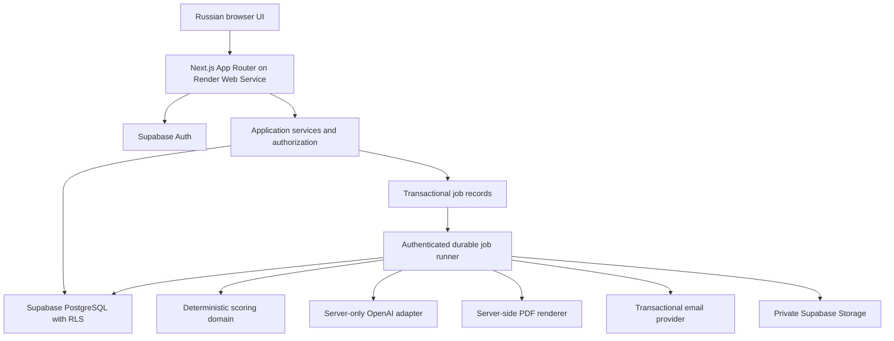
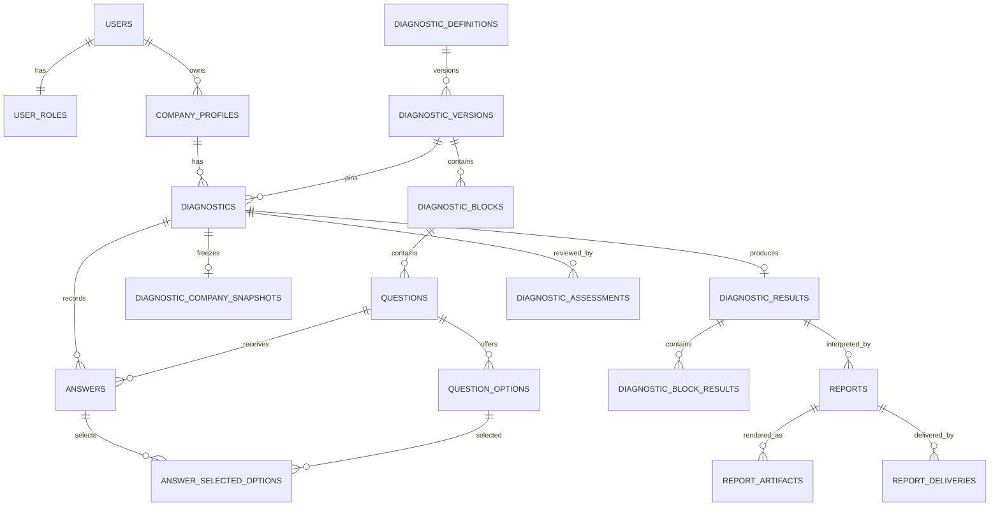

# Company Manageability AI Diagnostic — Proposed Architecture

Status: proposal for review; no application implementation authorized yet.
Date: 2026-09-09.

## 1. Scope and requirements

Build an independent Russian-language application using Next.js, strict TypeScript, Tailwind CSS, PostgreSQL through hosted Supabase, Supabase Auth, server-side OpenAI integration, server-generated PDF, and separate Render web/worker services. No Bubble or other no-code runtime dependencies.

The product covers registration, login, email verification when configured, company profile editing, repeatable diagnostics with autosave, required-answer validation, deterministic block and overall results, maturity classification, saved AI analysis, browser reports, PDF download, and user-requested email delivery. Administrators need searchable and filterable user, company, and diagnostic lists, contact details, dates, completion status, results, block scores, answers, company profiles, reports, and administrative assessment.

All user-visible text must be Russian, including authentication and recovery emails, validation, empty/loading/error states, PDF, report prose, and admin screens. Identifiers, source code, API paths, database names, and technical documentation are English. UI copy lives in locale catalogs; diagnostic content has translation tables. English UI can later be added using the same routes and services.

This document does not define questions, choices, weights, scoring formulas, score ranges, or maturity thresholds. These must come from the methodology owner. No sample diagnostic content should be shipped as an approved methodology. Existing Bubble data import and feature parity beyond the supplied requirements are not assumed; assess them separately if needed.

## 2. Architecture and boundaries

Use a modular monolith: one Next.js application plus a durable job execution path sharing domain modules. This minimizes operational complexity while separating calculations, AI, delivery, and presentation.



Responsibilities:

| Layer | Responsibility |
| --- | --- |
| Presentation | Server Components for reads; Client Components for interactive forms; Tailwind design system; Russian locale catalog |
| Transport | Route Handlers for autosave, submission, jobs, downloads and email; Server Actions may handle simple forms; shared services prevent duplicated business logic |
| Application | Verified identity, authorization, validation, workflow transitions, transaction orchestration and idempotency |
| Domain | Pure deterministic scoring contracts, methodology validation, completeness and maturity evaluation; no React, network calls or AI dependencies |
| Persistence | Typed repositories, SQL transactions/RPC, generated database types, migrations, grants, RLS and constraints |
| Integrations | Server-only Supabase clients, OpenAI, PDF, email and job runner adapters |

Use Supabase SQL migrations as the schema source of truth, with generated TypeScript types. Do not introduce a second migration authority through an ORM. Use shared runtime schemas, proposed Zod, at client and server boundaries; TypeScript alone cannot validate external input.

Normal request reads use the verified user's Supabase context so RLS applies. Sensitive multi-table mutations run through narrowly scoped transactional database functions with explicit authorization. Revoke direct writes to fields and tables controlled by those functions. Worker credentials are isolated and never used as a shortcut for ordinary user requests.

Next.js requires authorization at each server entry point; route visibility alone is insufficient. Use a server-only data access layer and minimal response DTOs. [Next.js data security](https://nextjs.org/docs/app/guides/data-security).

## 3. Relational data model

Conventions: UUID primary keys unless stated otherwise, `timestamptz` timestamps in UTC, English `snake_case`, indexed foreign keys, explicit deletion behavior. Use PostgreSQL `numeric` for diagnostic values and decimal arithmetic in TypeScript. Do not assume a 0–100 scale. JSONB is limited to validated extensible configuration, immutable snapshots, and structured report content; ownership and entity relationships remain relational.

Proposed initial ownership: one company has one owning user; a user may own several companies. Company collaboration and membership roles are deferred pending product confirmation. Global application roles are exactly `administrator` and `user`.

### Identity and companies

| Table | Main columns and constraints |
| --- | --- |
| `auth.users` | Supabase-managed identity, credentials and verified email; do not duplicate passwords |
| `users` | `id` PK/FK to `auth.users.id`, `full_name`, `phone`, `locale`, `created_at`, `updated_at`; email remains authoritative in Auth |
| `user_roles` | `user_id` PK/FK to `users`, `role` constrained to `administrator` or `user`; only trusted provisioning can change roles |
| `company_profiles` | `id`, `owner_user_id` FK to `users`, `name`, `revision`, timestamps; additional typed business fields defined after profile requirements are supplied |

Provision `users` and a default `user` role transactionally during signup. Never take a role from signup metadata. Admin contact lists use an authorized server query against Auth, avoiding client exposure of its schema. If an email search projection becomes necessary at scale, define secure synchronization and access explicitly.

### Versioned methodology

| Table | Main columns and constraints |
| --- | --- |
| `diagnostic_definitions` | `id`, unique `key`, timestamps; stable identity across versions |
| `diagnostic_versions` | `id`, `definition_id` FK, `version_number`, `status` (`draft`, `published`, `retired`), `content_hash`, `published_at`; unique `(definition_id, version_number)` |
| `diagnostic_version_translations` | PK `(version_id, locale)`, `title`, `description` |
| `diagnostic_blocks` | `id`, `version_id` FK, `key`, `position`, nullable `weight`, validated `configuration`; unique key and position within version |
| `diagnostic_block_translations` | PK `(block_id, locale)`, `title`, `description` |
| `questions` | `id`, `version_id`, `block_id`, `key`, `position`, `answer_type`, `is_required`, nullable `weight`, validated `validation_config`; unique key within version and position within block |
| `question_translations` | PK `(question_id, locale)`, `prompt`, `help_text` |
| `question_options` | `id`, `question_id`, `key`, `position`, nullable numeric `score_value`, nullable `weight`; unique key and position within question |
| `question_option_translations` | PK `(option_id, locale)`, `label` |
| `scoring_policies` | `id`, unique `version_id` FK, `engine_key`, `engine_version`, `schema_version`, validated `configuration`, `policy_hash` |
| `maturity_levels` | `id`, `version_id` FK, `key`, `position`, validated `classification_config`; unique key within version |
| `maturity_level_translations` | PK `(maturity_level_id, locale)`, `label`, `description` |

Weights, score values and configurations are placeholders for externally supplied rules, not default mathematics. Supported answer types and conditional question behavior must be confirmed. The renderer selects a component by a supported type rather than by question ID. A new content item or supported configuration needs no code change; a fundamentally new input type or calculation operation can require a new tested engine implementation. Never execute arbitrary SQL or JavaScript stored as a methodology formula.

Publishing is an atomic validation operation: verify supported types and engine, required translations, order, complete rule configuration, reference integrity and supplied scoring examples. Published methodology rows and their children are immutable in the database. Changes create a new version with new child IDs. Retirement prevents new starts but preserves existing attempts. Referenced versions cannot be deleted.

### Attempts, answers and results

| Table | Main columns and constraints |
| --- | --- |
| `diagnostics` | `id`, `company_id` FK, `created_by_user_id` FK, `version_id` FK, `locale`, `status` (`in_progress`, `submitted`, `scoring`, `completed`, `scoring_failed`), `revision`, `last_saved_at`, `started_at`, `submitted_at`, `completed_at` |
| `diagnostic_company_snapshots` | `diagnostic_id` PK/FK, `schema_version`, `profile_revision`, immutable `profile_data`, `captured_at`; authoritative company context captured at submission |
| `answers` | `id`, `diagnostic_id`, `version_id`, `question_id`, nullable typed `text_value`, `numeric_value`, `boolean_value`, `revision`, timestamps; unique `(diagnostic_id, question_id)` |
| `answer_selected_options` | PK `(answer_id, option_id)`, `question_id`; join table for option selections |
| `diagnostic_results` | `id`, unique `diagnostic_id`, `version_id`, `overall_index_raw`, `overall_index_rounded`, `maturity_level_id`, `engine_version`, `policy_hash`, `input_hash`, validated `calculation_trace`, `calculated_at` |
| `diagnostic_block_results` | PK `(result_id, block_id)`, `version_id`, `score_raw`, validated `calculation_details` |
| `diagnostic_assessments` | `id`, `diagnostic_id` FK, `administrator_id` FK, `notes`, nullable `assessment_data`, `created_at`; append-only assessments, separate from computed results |

Use composite foreign keys and corresponding unique constraints to enforce that a question belongs to its block/version, an answer's question belongs to the attempt's version, selected options belong to the answer's question, block results belong to the result version, and maturity levels belong to the same version. Repeating `version_id` or `question_id` in these rows is deliberate integrity support.

Answer validation enforces exactly the payload shape allowed by the question type, including single-choice cardinality and bounds. Cross-row constraints require transactional functions or constraint triggers, not unsupported cross-table `CHECK` expressions. Requiredness is validated over the full effective question set at submission. An unanswered question is absence, not numeric zero or false. Optional omissions and conditional visibility semantics await the methodology.

Results and submitted answers are immutable. The proposal creates one authoritative result per attempt; corrections require an explicit audited supersession policy before implementation, not overwriting historical scores. Administrative assessment does not change arithmetic or AI output. Its rubric and user visibility remain undecided.

### Reports and operational data

| Table | Main columns and constraints |
| --- | --- |
| `report_templates` | `id`, `key`, `version`, `locale`, `prompt_version`, `prompt_body`, `output_schema_version`; unique `(key, version, locale)`, immutable once used; restricted to trusted operators |
| `reports` | `id`, `result_id` FK, `template_id` FK, `revision`, `status` (`pending`, `generating`, `ready`, `failed`), `locale`, `input_snapshot`, `input_hash`, nullable `content`, `model_id`, provider request ID, usage metadata, safe error code, timestamps; unique `(result_id, revision)` |
| `report_artifacts` | `id`, `report_id` FK, `format`, `template_version`, `status`, private `storage_path`, `checksum`, timestamps; unique `(report_id, format, template_version)` |
| `report_deliveries` | `id`, `report_id` FK, `requested_by_user_id` FK, verified recipient snapshot, `idempotency_key`, `status`, provider message ID, safe error code, timestamps |
| `jobs` | `id`, `kind`, target entity IDs, unique `idempotency_key`, `status`, `attempt_count`, `available_at`, `lease_expires_at`, `lease_token`, safe error code, timestamps; internal schema only |
| `audit_events` | `id`, actor ID, action, entity type/ID, request ID, minimal redacted metadata, timestamp; append-only, internal schema |

`reports.content` stores validated structured prose and evidence references, not executable HTML. A ready revision and its input are immutable. An explicit regeneration creates another revision; transport retries reuse the original row. PDF and email status are independent from successful diagnostic calculation and report generation.

### Cardinalities and lifecycle



Translations belong to their respective content rows with one row per locale. Each published version has one scoring policy and the supplied maturity levels. An attempt references exactly one version and one company. A new diagnosis creates another attempt; previous answers are not silently reused.

Default to `RESTRICT` deletion for historical methodology, submitted diagnostics and reports. Draft-only children may cascade under controlled deletion. Account erasure needs an explicit retention/anonymization procedure covering Auth, database, storage, jobs and external providers; do not cascade away audit/history accidentally. Immutable means protected from routine editing, not exempt from the eventual approved privacy deletion process.

Indexes should cover company ownership, attempts by company/date and status/date, answers by attempt, jobs by status/availability, report relations, and assessment dates. Admin search uses parameterized, paginated queries; add appropriate name/contact search indexes based on measured needs. No production customer data in development fixtures.

## 4. User workflows and consistency

### Authentication and company profile

Use Supabase Auth with server-verified sessions, supported SSR cookie handling, allowlisted verification/reset redirects, logout and password recovery. Whether verified email gates all diagnostics must be decided; delivery always requires a verified recipient. Localize Auth templates. User and administrator share the identity system, with separate authorized screens; require MFA for administrator access as the proposed baseline.

Company edits use field allowlists, runtime validation and optimistic revisions. The submitted diagnostic freezes its company profile, so later company edits cannot change historical report context. Show the profile to the user for review before submission.

### Autosave and resume

Create an attempt referencing a published version. Save edited answers after a short debounce and on blur, serialize pending edits per attempt, and display explicit Russian saving/saved/failed states. The server acknowledgment is the durable save boundary. Flush pending saves before block navigation and submission. Browser shutdown cannot guarantee delivery; warn on unsaved changes and never claim offline edits have been saved. A persistent offline draft is not included until its privacy and conflict policy is approved.

Proposed endpoint: `PATCH /api/diagnostics/{id}/answers`, accepting an allowlisted batch, `expected_revision` and a mutation ID. In one transaction: verify ownership, lock the attempt, require `in_progress`, validate version/type/options, reject stale revision with `409`, upsert answers and increment revision. Retry uncertain network requests with the same mutation ID; store deduplication records transactionally or return the committed revision safely. Multi-tab conflicts must be visible rather than silently overwriting answers. Resume loads saved values and progress from the database; progress is not a score.

### Submission and deterministic scoring

`POST /api/diagnostics/{id}/submit` verifies identity and ownership, locks the same attempt row used by autosave, checks expected revision and required answers against the pinned methodology, captures the company profile under a consistent transaction, changes status to `submitted`, and inserts a scoring job atomically. Missing answers return structured field errors without changing status. Retried submissions return the existing state. All answer write paths, including direct database access, must respect the state lock.

The scoring worker loads only committed inputs and the pinned policy. A pure scoring module produces block values, the overall index and maturity classification from the supplied rules. Persist result, block results, calculation provenance, completion status and a report job in one transaction. A unique result constraint prevents duplicate authoritative results. Failure preserves frozen answers and supports a controlled retry.

Store raw precision and the final index rounded to one decimal place. All channels use the same persisted rounded value, formatted using the chosen locale. Rounding mode, intermediate rounding, and whether maturity uses raw or rounded values must be supplied before coding; do not invent them. No OpenAI dependency is needed for scoring or viewing computed results.

### AI report generation

The server assembles an immutable, schema-versioned input from the saved result, saved answers, pinned methodology and submission-time company snapshot. Include only necessary company context; exclude email and phone by default. Store that exact input and a hash before calling OpenAI, along with the template/prompt version and configured model identifier.

Use a structured output schema for analysis, conclusions and recommendations, with valid block/question evidence references. Server validation must also handle refusal, incomplete output, invalid references and unsupported assertions; schema compliance is not factual correctness. [OpenAI structured outputs](https://developers.openai.com/api/docs/guides/structured-outputs).

AI must not calculate or select indices, block scores or maturity. The report renderer inserts those directly from `diagnostic_results` and `diagnostic_block_results`; the AI schema should avoid authoritative numeric score fields. Validate prose for contradictions to stored results and reject/retry or flag uncertain output. Treat answer text as untrusted data, prohibit following instructions embedded in answers, and give the model no tools or database access. Do not enable unsupervised external actions.

Persist a validated report before making it available. Browser, PDF and email use the same saved revision; viewing and downloading must never trigger an untracked AI regeneration. On AI failure the user can still view deterministic results and a localized report status.

### Durable jobs, PDF and email

Use the `jobs` table as a transactional outbox/queue. A scheduled authenticated dispatcher or durable runner claims jobs atomically with leases; process each external step separately. Use bounded exponential backoff with jitter, timeouts, heartbeat/lease renewal, maximum attempts, failed-job inspection and explicit retries. Fencing tokens prevent expired workers from committing over newer attempts. Delivery is at least once: unique keys and state transitions deduplicate database effects. External calls can still be repeated after a crash; use provider idempotency where available and acknowledge that exactly-once email delivery is not guaranteed otherwise.

Do not rely on fire-and-forget promises or a browser request staying open. The Render web service handles request-bound work while the separate Render Background Worker owns durable jobs. AI timeout, PDF renderer and batch sizes must fit the selected Render service limits and pass the staging smoke test.

Generate PDF in a server Node.js runtime from the persisted report and results. Proposed starting option: a typed PDF template with an embedded Cyrillic font and controlled pagination; compare it with an HTML-to-PDF renderer in a deployment spike before committing to a library. Verify long Russian text, tables, page breaks and selectable text. Store versioned artifacts in a private bucket. Downloads require current authorization and either a streamed response or a short-lived signed URL; never use public report objects.

Email is a separately requested job sent through a transactional provider selected before implementation. Default recipient is the requesting user's currently verified Auth email; do not allow arbitrary recipient addresses without a separately designed flow. Decide attachment versus authenticated download link, expiry, size limits and retention. Track queued/sent/delivered/bounced/failed distinctly, verifying webhook signatures and deduplicating events. PDF/email retries reuse the saved report and do not rerun scoring or AI.

## 5. Access control and security risks

RLS and explicit grants are both required. Supabase privileged service credentials bypass RLS and must remain server-only; inspect views and database functions for bypasses as well. [Supabase RLS](https://supabase.com/docs/guides/database/postgres/row-level-security).

| Resource | Ordinary user | Administrator | Internal worker/provisioner |
| --- | --- | --- | --- |
| User profile | Read/edit own allowed fields | Read contact/profile listings | Provision identity projection |
| Roles | Read own role only | No general client-side role writes | Trusted audited assignment/revocation |
| Company profile | Read/edit owned company | Read all for administration | No unrestricted routine edits |
| Methodology | Read published content and pinned historical content | Read; publication tooling separately scoped | Validated controlled import/publication |
| Diagnostics/answers | Own company; writes only while in progress through guarded operations | Read all; no score or answer rewriting | Guarded workflow transitions |
| Results/reports/PDF | Read owned company records | Read all | Create via authorized jobs |
| Assessments | Denied until visibility is decided | Read/create append-only assessments | Audit |
| Deliveries | Request own verified-email delivery; read own status | Inspect authorized status | Send/update status |
| Jobs/prompts/audit | No direct access | Sanitized operational access only as needed | Minimum required permissions |

Child policies derive access through the parent attempt/company; never trust a submitted owner ID. Apply `USING` and `WITH CHECK` where applicable, restrict ownership/role/status columns, and enable RLS on all exposed data tables and storage objects. Keep jobs and sensitive prompt/audit internals outside exposed schemas. Any `SECURITY DEFINER` function has a fixed safe `search_path`, minimal grants, explicit actor checks and tests. Privileged workers accept only stored job targets, not arbitrary browser-supplied SQL or storage paths. Role checks use authoritative controlled role data; session claims must not allow stale administrator access after revocation.

| Risk | Proposed mitigation |
| --- | --- |
| Cross-company access / IDOR | Server ownership checks plus RLS, guarded RPC, private storage and two-user adversarial tests |
| Privilege escalation | Protected role table, no editable metadata authorization, admin MFA, audited provisioning and revocation |
| Secret exposure | Server-only imports; no secret in `NEXT_PUBLIC_*`, DTO, source map or log; secret scanning and rotation |
| Session theft, CSRF, redirect abuse | HTTPS, supported secure cookie configuration, origin checks for mutations, redirect allowlists, CSP and session verification |
| SQL injection, mass assignment, forged scores | Parameterized access, explicit input schemas and column grants; client scores ignored; worker-only result writes |
| XSS / unsafe AI content / PDF SSRF | Render validated plain text or sanitized constrained markup; escape content; no arbitrary remote assets or URLs in PDF rendering |
| Prompt injection and misleading analysis | Separate instructions/data, no model tools, constrained output, evidence validation, deterministic authoritative scores and reviewed fixtures |
| Cost abuse / email spam | Limits per actor/IP/company, attempt and generation quotas, token/input caps, provider timeouts, email throttling |
| Lost edits and duplicate work | Transactional locks, revisions, deduplication keys, immutable submission, durable jobs and bounded retries |
| Confidential business data leakage | Minimal AI payloads, log redaction, no shared caching of private pages, private buckets, audited admin access |
| Dependency and deployment compromise | Locked dependencies, CI checks, secret isolation across preview/staging/production, reviewed migrations |
| Data loss and privacy violations | Retention/deletion policy, backups and restore drills including storage, agreed hosting regions and provider data terms |

Before enabling OpenAI in production, review applicable endpoint retention and organization data controls; do not promise zero retention without verifying account eligibility and configuration. [OpenAI data controls](https://platform.openai.com/docs/guides/your-data).

## 6. Proposed project layout

```text
src/
  app/
    [locale]/
      (public)/page.tsx
      (auth)/login/page.tsx
      (auth)/register/page.tsx
      (auth)/verify-email/page.tsx
      (auth)/forgot-password/page.tsx
      (auth)/reset-password/page.tsx
      (workspace)/dashboard/page.tsx
      (workspace)/companies/[companyId]/page.tsx
      (workspace)/diagnostics/[diagnosticId]/page.tsx
      (workspace)/reports/[reportId]/page.tsx
      (admin)/admin/users/page.tsx
      (admin)/admin/companies/page.tsx
      (admin)/admin/diagnostics/page.tsx
      (admin)/admin/diagnostics/[diagnosticId]/page.tsx
    auth/callback/route.ts
    api/diagnostics/route.ts
    api/diagnostics/[diagnosticId]/answers/route.ts
    api/diagnostics/[diagnosticId]/submit/route.ts
    api/reports/[reportId]/pdf/route.ts
    api/reports/[reportId]/email/route.ts
    api/internal/jobs/route.ts
    api/webhooks/email/route.ts
  components/ui/
  features/
    auth/
    companies/
    diagnostics/
    reports/
    admin/
  domain/
    methodology/
    scoring/
    diagnostics/
    reports/
  server/
    auth/
    authorization/
    services/
    repositories/
    supabase/
    jobs/
    integrations/openai/
    integrations/email/
    pdf/
    observability/
  validation/
  i18n/
  messages/ru.json
  types/database.generated.ts
supabase/
  migrations/
  tests/
  seed.sql
tests/
  unit/
  integration/
  e2e/
  fixtures/
public/fonts/
scripts/
docs/decisions/
.env.example
ARCHITECTURE.md
```

This is a proposed layout, not generated application scaffolding. Production methodology is loaded through validated, versioned import/publication tooling; seed data must not invent a real questionnaire. Locale routing initially accepts only `ru`; technical route segments remain English. A future `en` catalog and methodology translations reuse the same architecture.

## 7. Development stages and acceptance gates

| Stage | Deliverables | Completion evidence |
| --- | --- | --- |
| 1. Product and methodology contract | Resolve decisions below; obtain approved question/rule specification, profile fields and representative expected results | Signed-off data contracts and examples; no invented formulas |
| 2. Foundation | Next.js/strict TS/Tailwind/i18n, CI, isolated environments, local Supabase, configuration validation | Reproducible build, lint/type checks, no exposed secrets |
| 3. Database and identity | SQL migrations, generated types, grants/RLS, Auth, company CRUD and administrator provisioning | Clean migration replay; signup/recovery/verification tests; cross-user and admin authorization tests |
| 4. Methodology and diagnostic flow | Validated import/publication, database-driven forms, autosave, resume, submission and snapshots | Interrupted-network and multi-tab tests; required-answer enforcement; immutable historical versions |
| 5. Deterministic engine | Supplied rules only, decimal arithmetic, persisted block/overall values and maturity, durable scoring jobs | Golden fixtures from methodology owner; rounding/threshold/omission cases; repeatability without OpenAI |
| 6. AI and browser report | Versioned prompt/schema, minimal saved input, server-only API integration, retries and saved report viewer | Refusal/timeout/invalid-output tests; evidence checks; result-to-report consistency; no AI arithmetic authority |
| 7. PDF and email | Server renderer, private artifacts, download authorization, verified-recipient jobs and delivery tracking | Cyrillic visual QA, long report layout, Render runtime check, signed-link isolation and duplicate-request tests |
| 8. Administration | Paginated lists, name/contact search, company/status/date filters, detailed answers/results/reports and assessment | Admin-only access, usable date semantics, immutable assessment history and role revocation tests |
| 9. Production readiness | Load/security/accessibility checks, observability, runbooks, backup/restore and deployment rehearsals | Agreed latency/cost targets, queue recovery tests, alerting, restore evidence and release checklist |

Use UTC storage with explicit localized dates and a documented timezone for admin filters. CI checks include type checking, linting, production build, domain tests, database/RLS integration tests and core browser flows. Use mocked providers in routine CI, with controlled staging smoke tests. Assess AI quality with reviewed Russian fixtures; do not snapshot nondeterministic prose as the sole quality test.

Track autosave errors, scoring failures, job age, AI latency/token cost, PDF duration, email bounces and authorization failures using correlation IDs, without logging answers or report bodies. Define RPO/RTO, retention and response objectives before launch. Database and storage recovery must both be rehearsed. Promote migrations through staging with compatible rollout and rollback/recovery plans; Render previews and staging services must never use production secrets or customer data.

## 8. Decisions required before implementation

| Decision | Proposal or unresolved boundary |
| --- | --- |
| Methodology source and acceptance | Obtain exact blocks, questions, options, ordering, weights, supported types, requiredness and examples; prerequisite for engine and production content |
| Arithmetic and maturity | Obtain aggregation rules, missing/not-applicable behavior, scale, precision, rounding mode, threshold boundaries and raw-versus-rounded classification |
| Ownership and company access | Confirm single owner / multiple companies; decide whether coworkers need shared access before finalizing policies |
| Company profile schema | Supply mandatory business/contact fields and validation; approve which fields enter AI input |
| Diagnostic lifecycle | Confirm retirement behavior, in-progress expiry, concurrent attempts, correction/supersession and deletion policies |
| Version publishing | Proposed validated operator import initially; decide whether an admin methodology editor is required and who can publish |
| Administrative assessment | Define rubric, structured fields, revision policy, visibility and whether it can trigger a separate report revision; never silently overwrite computed results |
| Authentication policy | Confirm email verification gate, administrator MFA, session policy and initial admin provisioning |
| Report contract | Approve structure, language, intended interpretation limits, prompt governance, model evaluation criteria and regeneration permissions |
| Jobs and hosting | Validate the selected Render web/background-worker deployment and retry budget; agree expected volume and execution/cost ceilings |
| PDF and email | Select renderer and provider; confirm fonts/branding, attachment versus link, recipient rules and delivery/retention semantics |
| Privacy and operations | Determine applicable jurisdiction, regions, provider retention, user consent/notice, erasure, audit retention, backups and RPO/RTO |
| Existing Bubble migration | Confirm whether historical users/companies/answers/reports require migration; obtain source schema and exports if so; never assume authentication credentials are portable |

These decisions are prerequisites for the affected implementation stages, not a request to implement the full application now. The proposed design preserves a strict boundary: methodology defines mathematics, the deterministic engine calculates it, and AI interprets saved facts.
